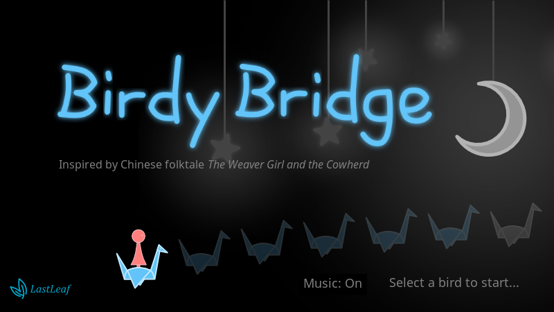
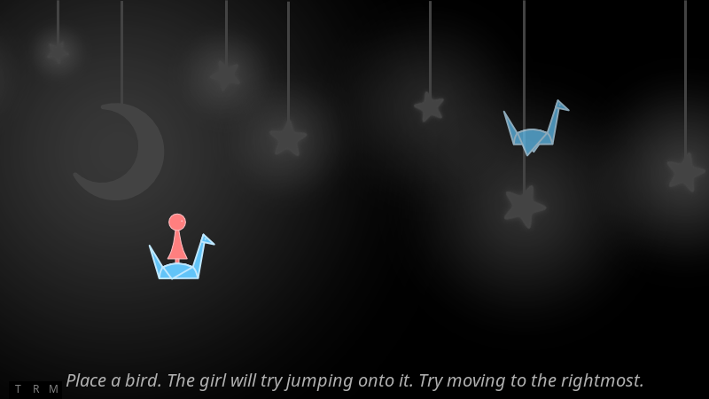

# Birdy Bridge #

It is my Ludum Dare 33 Game. [v1.0.0](https://github.com/LastLeaf/birdy-bridge/releases/tag/v1.0.0) was made in 48 hours. The Ludum Dare entry is [here](http://ludumdare.com/compo/ludum-dare-33/?action=preview&uid=47265).

This game is inspired by the Chinese folktale *[The Weaver Girl and the Cowherd](https://en.wikipedia.org/wiki/The_Weaver_Girl_and_the_Cowherd)*.

# How to Play #

Play from [GitHub Page](http://github.lastleaf.me/birdy-bridge/). Please use latest Chrome or Firefox for best experience.

Hints:

* If you feel a level is difficult, you can go back to title page (the "T" button in the left bottom), and select next level.
* Observation and strategy are important!

Original sound tracks are FLAC files [here](https://github.com/LastLeaf/birdy-bridge/tree/master/src/ost).

# Third Party Resource and Tools #

* [CreateJS](http://www.createjs.com/) are used as HTML5 game framework.
* [Google Noto Fonts](https://www.google.com/get/noto/) are included.
* [imgprocessor](https://github.com/lastleaf/imgprocessor) are used for image processing in browsers.
* Source svg graphics created by Inkscape are in "src/svg".
* Sound tracks are created with Rosegarden and General User GS Soundfont. Source files are ".rg" files in "src/ost".
